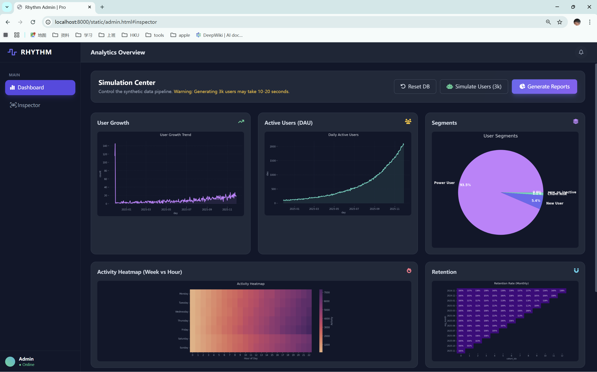

# Music Membership Analytics Project

[English](#english) | [中文](README_zh.md)

<p>
  <a href="README_zh.md" style="display:inline-block;padding:8px 12px;border:1px solid #ccc;border-radius:6px;text-decoration:none;">中文版本</a>
</p>

End-to-end pipeline: schema -> simulate data -> class library -> text mining stubs -> dashboards -> static pages + API.

---

## English

### Overview
Visuals of the admin and registration pages:




### Prerequisites
- Python 3.9+ (Anaconda env `workingenvs` is fine)
- SQLite only (no external DB)

### Quickstart (from repo root)
```bash
# 0) create/activate venv and install deps
python -m venv .venv
.venv/Scripts/activate
pip install -r requirements.txt

# 1) init DB
python scripts/init_db.py

# 2) simulate data (users, prefs, listening logs, feedbacks, segments)
python -m scripts.simulate_data

# 3) run demo (register user -> logs -> text mining -> segmentation)
python -m scripts.demo

# 4) generate dashboard charts (PNG to outputs/)
python scripts/generate_dashboard.py

# 5) run API backend (FastAPI)
uvicorn api.server:app --reload --port 8001

# 6) serve static pages (e.g., port 8000)
python -m http.server 8000
# open http://localhost:8000/static/admin.html
# open http://localhost:8000/static/register.html
```

### Contents
- `schema.sql` - all tables (core + optional segments/topics)
- `requirements.txt` - dependencies
- `src/music_app_system.py` - core class: register/login, membership, logging, analytics, text hooks, segmentation write-back
- `src/text_mining.py` - lightweight keyword/MBTI/segment rules (placeholder logic)
- `scripts/init_db.py` - create `data/music.db`
- `scripts/simulate_data.py` - simulate ~800 users; preferences; 5-200 listens/user; 0-3 feedbacks/user; auto segments
- `scripts/demo.py` - end-to-end flow for a new user
- `scripts/generate_dashboard.py` - DAU, registration trend, preference, member vs non-member, segment charts -> `outputs/`
- `api/server.py` - FastAPI backend (register/search/actions: init_db, simulate_data, generate_dashboard, status)
- `static/admin.html` - admin dashboard (PNG charts, user search, action buttons with status polling)
- `static/register.html` - user registration form (POSTs to `/api/register`)

### Tips / Troubleshooting
- If imports fail, run scripts with `python -m scripts.xxx` from repo root (puts `src` on path)
- Timestamps may include fractional seconds; dashboard parsing uses `errors="coerce"`
- Regenerate data: rerun `init_db.py` (optional reset) then `-m scripts.simulate_data`
- Static pages auto-target API on port 8001 when served on 8000; set `window.API_BASE` if you proxy differently

---

## 中文版本
请点击上方按钮或链接查看 `README_zh.md`。
