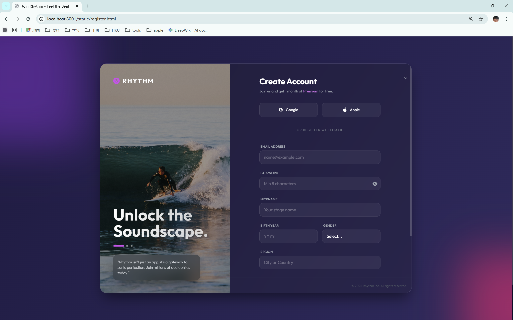

# 音乐会员分析项目

端到端流程：建表 -> 模拟数据 -> 程序类库 -> 文本挖掘占位 -> 看板 -> 静态页面 + API。

### 概览
管理页与注册页示意：




## 环境要求
- Python 3.9+（推荐 Anaconda `workingenvs` 环境）
- 无需外部数据库（内置 SQLite）

## 快速开始（仓库根目录运行）
```bash
# 0）创建/激活虚拟环境并安装依赖
python -m venv .venv
.venv/Scripts/activate
pip install -r requirements.txt

# 1）初始化数据库
python scripts/init_db.py

# 2）模拟数据（用户、偏好、听歌日志、反馈、分群）
python -m scripts.simulate_data

# 3）Demo（注册新用户 -> 行为日志 -> 文本挖掘 -> 分群）
python -m scripts.demo

# 4）生成看板图表（PNG 输出到 outputs/）
python scripts/generate_dashboard.py

# 5）启动后端 API（FastAPI）
uvicorn api.server:app --reload --port 8001

# 6）查看静态页面（本地起一个 server，比如 8000）
python -m http.server 8000
# 打开 http://localhost:8000/static/admin.html
# 打开 http://localhost:8000/static/register.html
```

## 目录说明
- `schema.sql` - 表结构（核心 + 可选分群/主题）
- `requirements.txt` - 依赖
- `src/music_app_system.py` - 核心类：注册/登录、会员、日志、统计、文本钩子、分群写回
- `src/text_mining.py` - 轻量关键词/MBTI/分群规则（占位实现）
- `scripts/init_db.py` - 创建 `data/music.db`
- `scripts/simulate_data.py` - 模拟约 800 用户，偏好，5-200 次听歌/人，0-3 条反馈/人，并自动分群
- `scripts/demo.py` - 新用户全流程演示
- `scripts/generate_dashboard.py` - 生成 DAU、注册趋势、偏好、会员对比、分群图表 -> `outputs/`
- `api/server.py` - FastAPI 后端（注册/搜索/动作：init_db、simulate_data、generate_dashboard、status）
- `static/admin.html` - 管理端页面（展示 PNG、查用户、触发动作并轮询状态）
- `static/register.html` - 用户注册表单（POST 到 `/api/register`）

## 备注与排查
- 导入报错时，用 `python -m scripts.xxx` 在仓库根目录运行，确保能找到 `src`
- 时间戳含小数秒，生成图表时已用 `errors="coerce"` 容错
- 重置数据：先跑 `init_db.py`（如需清库），再跑 `-m scripts.simulate_data`
- 静态页默认在 8000 服务、API 在 8001；如有反向代理，可通过 `window.API_BASE` 覆盖
